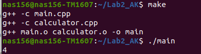
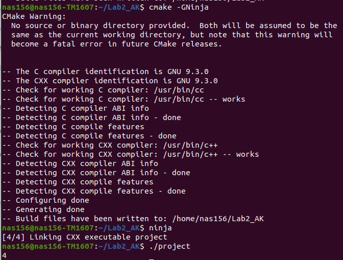

# AK2_LAB2

## Результати виконання збірок:  




## Лістинг:

### calculator.cpp

```cpp
#include "calculator.h"
int Calculator::Add (double a, double b)
{
	return a + b + 0.5;
}
int Calculator::Sub (double a, double b)
{
	return Add (a, -b);
}
```
### calculator.h

```cpp
#ifndef CALCULATOR_H
#define CALCULATOR_H
class Calculator
{
 public:
 	int Add (double, double);
 	int Sub (double, double);
};
#endif//CALCULATOR_H
```

### main.cpp

```cpp
#include <iostream>
#include "calculator.h"
using namespace std;
int main(){
	Calculator calculator;
	cout << calculator.Add(5, 7) << endl;
	return 0;
}
```

### Makefile

```makefile
Lab2: main.o calculator.o
	g++ -o Lab2 main.o calculator.o
main.o: main.cpp 
	g++ -c main.cpp
calculator.o: calculator.cpp
	g++ -c calculator.cpp
clean: 
	rm Lab2
	rm main.o
	rm calculator.o
```
### CMakeLists.txt

```cmake
cmake_minimum_required(VERSION 3.16.3)
project("Lab2_AK")
 
add_library(calculator STATIC calculator.cpp)
add_executable("${PROJECT_NAME}" main.cpp)
target_link_libraries("${PROJECT_NAME}" calculator)
```
